# The BACK Stack

Find out more [backstack.dev](https://backstack.dev)

The Basic architecture of the stack:


Watch the KubeCon NA 2023 session: [Introducing the BACK Stack!](https://youtu.be/SMlR12uwMLs)

## Install the BACK Stack

You will use [Porter][getporter] to perform the installation. Currently, the generated Bundle supports installing the BACK stack on EKS or locally using KinD

### Porter Bundle Info & Settings {#porter-install}

Credentials:

**NOTE**: Although cloud provider credentials are not required, you cannot provision new clusters.

---

| Name              | Description                                            | Required | Comments |
| ----------------- | ------------------------------------------------------ | -------- | - |
| aws-credentials   | Credentials to be used for Crossplane `provider-aws`   | false    | This is required if `cluster-type` is set to `eks` |
| azure-credentials | Credentials to be used for Crossplane `provider-azure` | false    |   |
| github-token      | Github API token                                       | true     |   |
| kubeconfig        | kubeconfig to connect to non-local cluster             | false    |   |
| vault-token       | This should always be `root`                           | true     |   |

Parameters:

---

| Name           | Description                                                       | Type   | Default                                  | Required | Comments |
| -------------- | ----------------------------------------------------------------- | ------ | ---------------------------------------- | -------- | - |
| argocd-host    | DNS name for ArgoCD                                               | string | `argocd-7f000001.nip.io`                 | false    |   |
| backstage-host | DNS name for Backstage                                            | string | `backstage-7f000001.nip.io`              | false    |   |
| cluster-type   | Target kubernetes cluster type. Accepted values are `kind`, `eks` | string | `kind`                                   | true     |   |
| repository     | Gitops repository for cluster requests and catalog-info           | string | `https://github.com/back-stack/showcase` | true     |   |
| vault-host     | DNS name for Vault                                                | string | `vault-7f000001.nip.io`                  | false    |   |

This bundle uses the following tools: docker, exec, helm3, Kubernetes.

To install this bundle, run the following commands, passing `--param KEY=VALUE` for any parameters you want to customize:

```sh
porter credentials generate mycreds --reference ghcr.io/back-stack/showcase-bundle:latest
```

```sh
porter install --reference ghcr.io/back-stack/showcase-bundle:latest --credential-set mycreds --param repository=https://github.com/USER/REPO
```

### Installing Locally into KinD

The Porter bundle already includes KinD, so the only prerequisite is Docker/Docker Desktop to be running.

1.  [Install porter](#porter-install)
2.  Generate the credentials config, leaving the `kubeconfig` empty (it will be ignored)

    ```sh
    porter credentials generate back-stack-cloud-creds --reference ghcr.io/back-stack/showcase-bundle:latest
    ```

3.  Install the bundle; the default `cluster-type` and `*-host` parameters are configured for local deployment, and you need to allow Porter to access your local docker daemon.

    ```sh
    porter install back-stack --reference ghcr.io/back-stack/showcase-bundle:latest --credential-set back-stack-cloud-creds --param repository=repository=https://github.com/USER/REPO --allow-docker-host-access
    ```

### Installing into EKS

-  Existing EKS cluster with [AWS Load Balancer Controller][alb-controller] add-on installed
-  local `kubeconfig` file to connect to the cluster

1.  Install porter (see above)
2.  Generate the credentials config, specifying the path to the `kubeconfig` file

    ```sh
    porter credentials generate back-stack-cloud-creds --reference ghcr.io/back-stack/showcase-bundle:latest
    ```

3.  Install the bundle; set `cluster-type` to `eks` and specify DNS names that you want to use to access the BACK stack services. This can either be done using `--param` flags or by generating a parameter set

    ```sh
    # using --param
    porter install back-stack --reference ghcr.io/back-stack/showcase-bundle:latest --credential-set back-stack-cloud-creds --param repository=repository=https://github.com/USER/REPO --param cluster-type=eks --param argocd-host=ARGOCD_DNS_NAME --param backstage-host=BACKSTAGE_DNS_NAME --param vault-host=VAULT_DNS_NAME

    # using parameter set
    porter parameters generate myparams --reference ghcr.io/back-stack/showcase-bundle:latest

    porter install back-stack --reference ghcr.io/back-stack/showcase-bundle:latest --credential-set back-stack-cloud-creds --parameter-set myparams
    ```

4.  After installation, you need to ensure the DNS names specified for `argocd-host`, `backstage-host`, and `vault-host` all resolve to the ingress service created during installation. The endpoint for this can be found by checking the bundle outputs

    ```sh
    porter installations output show ingress -i back-stack
    ```

    This can be done by updating the DNS records directly if you control them, or by updating `/etc/hosts` or using a local DNS server such as `dnsmasq`.

[getporter]: https://getporter.org
[alb-controller]: https://docs.aws.amazon.com/eks/latest/userguide/aws-load-balancer-controller.html
